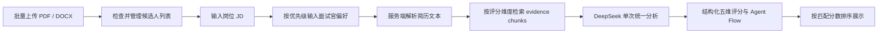

# AI Interview Copilot

> 🔗 **[在线体验 Live Demo](https://ai-interview-copilot.netlify.app)** · 部署即用，上传简历即可分析


---

面向 HR 实习生与招聘团队的 AI 候选人批量分析与排序工具。

系统支持一次上传多份 PDF 或 DOCX 简历，并结合岗位 JD 与面试官偏好优先级，通过 DeepSeek 生成统一的候选人匹配评分、推荐程度、核心优势与主要风险，帮助招聘人员更快识别值得进入面试的候选人。

> 当前项目为产品经理 / AI 产品方向的作品集项目，重点展示招聘场景中的问题定义、AI 工作流设计、结构化输出和批量筛选体验。

## 产品背景

传统招聘筛选流程通常存在以下问题：

- 多份简历需要逐一阅读，筛选耗时较长。
- 不同招聘人员的评估标准不一致。
- 岗位要求和面试官偏好难以同时纳入判断。
- 候选人数量较多时，缺少统一的横向比较和优先级排序。
- 错误上传一份简历后，往往需要重新整理整批文件。

AI Interview Copilot 将简历解析、岗位匹配和候选人排序整合为一个结构化工作流，让招聘人员能够基于同一套标准快速完成初步筛选。

## 核心功能

### 批量简历上传

- 支持一次选择多份 PDF 简历。
- 支持一次选择多份 DOCX 简历。
- 单次最多分析 20 份简历。
- 自动过滤重复选择的同一文件。
- 上传后展示文件名、格式和文件大小。
- 支持单独删除错误文件或一键清空列表。

### 岗位与偏好输入

- 支持粘贴完整岗位 JD。
- 支持按行填写面试官偏好。
- 偏好顺序即优先级，越靠前权重越高。
- 分析完成后保留 JD 和偏好，便于更换候选人继续筛选。

### AI 批量分析

- 将同一岗位标准应用于整批候选人。
- 使用 DeepSeek 完成候选人横向比较。
- 每份简历独立解析，单个文件失败不会中断整批任务。
- 基于岗位 JD 和偏好动态检索简历 evidence chunks。
- 使用岗位相关、项目证据、能力迁移、表达清晰和偏好匹配五个维度评分。
- 返回结构化 JSON，避免前端依赖非结构化文本。
- 自动按匹配分数从高到低排序。

### 候选人结果看板

每位候选人展示：

- 候选人姓名与原始文件名。
- 匹配分数与匹配等级。
- 推荐程度：推荐 / 谨慎考虑 / 不推荐。
- 2 至 4 项核心优势。
- 2 至 4 项主要风险。
- 推荐或不推荐的主要原因。

结果页同时汇总已分析人数、最高分、平均分、推荐推进人数和解析失败数量。候选人详情中可以查看五维评分、缺失关键词、评分理由，以及可折叠的 AI 分析流程。

### 可解释 AI 分析流程

系统通过单次大模型调用生成结构化多步骤结果，并在候选人详情中以轻量时间线展示：

1. **JD Agent**：提取岗位要求、关键词和岗位风险。
2. **Resume Agent**：解析候选人经历、技能和项目。
3. **Evidence Agent**：检索与当前岗位相关的简历证据。
4. **Scoring Agent**：生成五维评分与评分理由。
5. **Risk Agent**：识别候选人的主要风险点。
6. **Ranking Agent**：生成最终排序和推荐等级。

该流程用于提升分析过程的可解释性，不会将一次任务拆分成六次 API 请求。

## 用户流程



## 技术实现

### 技术栈

- **Frontend**：Next.js 16、React 19、TypeScript、Tailwind CSS 4
- **Backend**：Next.js App Router API Route
- **LLM**：DeepSeek Chat API
- **PDF 解析**：PDF.js、`@napi-rs/canvas`
- **DOCX 解析**：Mammoth
- **Evidence Retrieval**：本地 rule-based RAG
- **部署**：Netlify

### 分析数据流

1. 前端将多份简历、岗位 JD 和面试官偏好封装为 `multipart/form-data`。
2. `/api/parse-resume` 或 `/api/analyze` 独立提取每份 PDF、DOCX 中的文本，并记录解析失败文件。
3. 服务端对简历文本进行通用分段，再根据当前 JD 和面试官偏好按评分维度检索证据。
4. 服务端将候选人简历、证据引用和统一岗位标准组装为批量分析 Prompt。
5. DeepSeek 通过单次调用返回候选人结构化 JSON、五维评分和 Agent Flow。
6. 服务端校验并标准化分数、证据 ID、推荐程度和文本字段。
7. 前端按匹配分数降序展示候选人排名，详情内容按需展开。

主要返回结构：

```ts
type CandidateAnalysis = {
  candidateName: string;
  fileName: string;
  matchScore: number;
  matchLevel: string;
  scoreBreakdown: ScoreBreakdown;
  dimensionScores: DimensionEvidenceMap;
  strengths: string[];
  risks: string[];
  recommendation: "Yes" | "Maybe" | "No";
  recommendationReason: string;
  agentFlow: AgentFlowStep[];
};
```

## 项目结构

```text
AI-Interview-Copilot/
├── app/
│   ├── api/analyze/route.ts   # 简历解析、DeepSeek 调用与结果校验
│   ├── api/parse-resume/       # 单份简历独立解析接口
│   ├── globals.css            # 全局样式
│   ├── layout.tsx             # 页面元信息与根布局
│   └── page.tsx               # 上传、输入、分析状态与排名看板
├── lib/
│   ├── agent-flow.ts           # Agent Flow 类型与标准步骤
│   ├── candidate-scoring.ts    # 五维评分模型
│   ├── evidence-chunks.ts      # 简历分段与按维度证据检索
│   └── resume-parser.ts        # PDF / DOCX 文本解析
├── tests/                      # Evidence 与 Agent Flow 测试
├── types/
│   └── pdfjs-worker.d.ts      # PDF.js 类型声明
├── netlify.toml               # Netlify 构建环境配置
├── next.config.ts             # Next.js 服务端依赖配置
└── package.json
```

## 本地运行

### 1. 克隆项目

```bash
git clone https://github.com/bao14005622-hash/AI-Interview-Copilot.git
cd AI-Interview-Copilot
```

### 2. 安装依赖

建议使用 Node.js 22。

```bash
npm install
```

### 3. 配置环境变量

在项目根目录创建 `.env.local`：

```bash
DEEPSEEK_API_KEY=你的_DeepSeek_API_Key
DEEPSEEK_API_BASE=https://api.deepseek.com
DEEPSEEK_MODEL=deepseek-chat
```

请勿将 `.env.local` 或真实 API Key 提交到 GitHub。

### 4. 启动开发服务

```bash
npm run dev
```

浏览器访问 [http://localhost:3000](http://localhost:3000)。

## 可用命令

```bash
npm run dev      # 启动本地开发服务
npm run build    # 生成生产构建
npm run start    # 启动生产服务
npm run lint     # 运行代码检查
npm run test:evidence    # 运行 evidence chunks 测试
npm run test:agent-flow  # 运行 Agent Flow 测试
```

## Netlify 部署

项目包含 `netlify.toml`，可直接连接 GitHub 仓库进行部署。部署前需要在 Netlify 项目设置中添加以下环境变量：

- `DEEPSEEK_API_KEY`
- `DEEPSEEK_API_BASE`，值为 `https://api.deepseek.com`
- `DEEPSEEK_MODEL`，值为 `deepseek-chat`

添加或修改环境变量后，需要重新触发一次部署，新的服务端函数才能读取最新配置。

## 隐私与安全

- DeepSeek API Key 仅在服务端 API Route 中读取，不会发送到浏览器。
- `.env.local` 已被 Git 忽略，不应上传到公开仓库。
- 简历内容会被发送至 DeepSeek API 用于生成分析结果。
- 当前项目未接入数据库，不主动保存候选人简历和分析历史。
- 使用真实候选人数据前，应完成必要的授权、脱敏和隐私合规评估。

## 当前限制

- 扫描版或图片型 PDF 可能无法直接提取文本，目前未接入 OCR。
- 暂不支持旧版 `.doc` 文件。
- AI 结果用于辅助招聘人员判断，不应替代人工复核和正式招聘决策。
- 当前版本未包含登录、权限、历史记录、数据库和审计功能。

## 后续规划

- 引入 OCR，提高扫描版 PDF 的解析成功率。
- 优化 evidence chunks 的标题识别、关键词召回和岗位泛化能力。
- 支持候选人筛选条件和结果导出。
- 增加数据脱敏、权限控制和分析记录管理。
- 建立测试集，持续评估不同岗位下的评分稳定性与排序质量。

## 项目定位

这个项目不是一个普通聊天机器人，而是一个围绕招聘筛选流程设计的 AI 工作台。它重点解决三个产品问题：

1. 如何将模糊的招聘偏好转化为可执行的分析输入。
2. 如何让多位候选人在同一标准下被横向比较。
3. 如何将大模型输出转化为招聘人员可以快速阅读和采取行动的结构化结果。

## 免责声明

本项目仅用于学习、产品验证与作品集展示。AI 分析可能存在遗漏或偏差，所有招聘结论均应由具备相应权限的招聘人员结合面试和背景核验后作出。
